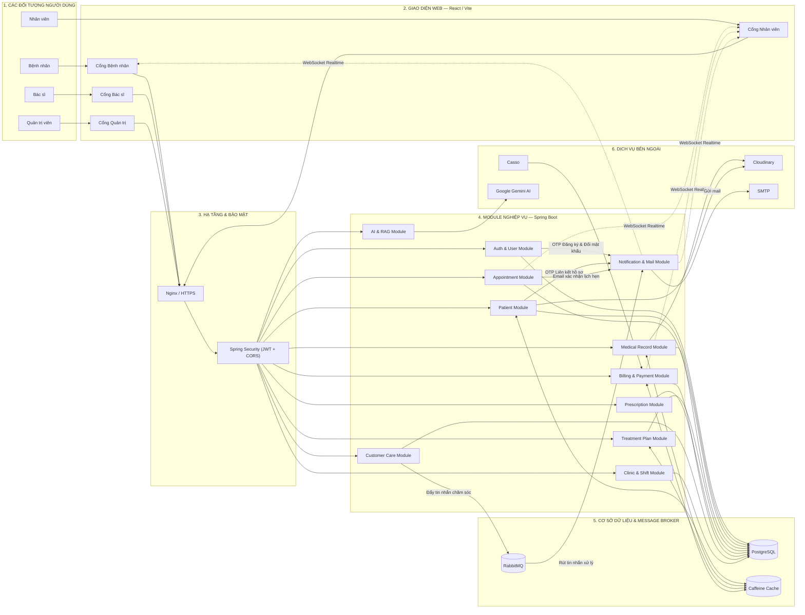

# SƠ ĐỒ KIẾN TRÚC HỆ THỐNG QUẢN LÝ PHÒNG KHÁM NHA KHOA (CROWN DENTAL)

```mermaid
flowchart LR
    %% 1. CÁC ĐỐI TƯỢNG NGƯỜI DÙNG
    subgraph K_Actors["1. CÁC ĐỐI TƯỢNG NGƯỜI DÙNG"]
        A_Patient["Bệnh nhân"]
        A_Staff["Nhân viên"]
        A_Dentist["Bác sĩ"]
        A_Admin["Quản trị viên"]
    end

    %% 2. GIAO DIỆN WEB
    subgraph K_WebClient["2. GIAO DIỆN WEB — React / Vite"]
        direction TB
        UI_Patient["Cổng Bệnh nhân"]
        UI_Staff["Cổng Nhân viên"]
        UI_Dentist["Cổng Bác sĩ"]
        UI_Admin["Cổng Quản trị"]
    end

    %% 3. HẠ TẦNG & BẢO MẬT
    subgraph K_Infra["3. HẠ TẦNG & BẢO MẬT"]
        direction TB
        Sec_Nginx["Nginx / HTTPS"]
        Sec_Security["Spring Security (JWT + CORS)"]
    end

    %% 4. MODULE NGHIỆP VỤ BACKEND
    subgraph K_Backend["4. MODULE NGHIỆP VỤ — Spring Boot"]
        direction TB
        M_Auth["Auth & User Module"]
        M_Patient["Patient Module"]
        M_Appt["Appointment Module"]
        M_EMR["Medical Record Module"]
        M_Treatment["Treatment Plan Module"]
        M_Prescription["Prescription Module"]
        M_Billing["Billing & Payment Module"]
        M_CustomerCare["Customer Care Module"]
        M_Notification["Notification & Mail Module"]
        M_AI["AI & RAG Module"]
        M_Clinic["Clinic & Shift Module"]
    end

    %% 5. CƠ SỞ DỮ LIỆU & BỘ NHỚ ĐỆM & MESSAGE BROKER
    subgraph K_Storage["5. CƠ SỞ DỮ LIỆU & MESSAGE BROKER"]
        DB_Postgres[("PostgreSQL")]
        MQ_Rabbit[("RabbitMQ")]
        Cache_Caffeine[("Caffeine Cache")]
    end

    %% 6. DỊCH VỤ BÊN NGOÀI
    subgraph K_External["6. DỊCH VỤ BÊN NGOÀI"]
        Ext_Casso["Casso"]
        Ext_Cloudinary["Cloudinary"]
        Ext_SMTP["SMTP"]
        Ext_Gemini["Google Gemini AI"]
    end

    %% KẾT NỐI ACTOR -> WEB CLIENT
    A_Patient --> UI_Patient
    A_Staff --> UI_Staff
    A_Dentist --> UI_Dentist
    A_Admin --> UI_Admin

    %% KẾT NỐI WEB CLIENT -> HẠ TẦNG BẢO MẬT
    UI_Patient & UI_Staff & UI_Dentist & UI_Admin --> Sec_Nginx
    Sec_Nginx --> Sec_Security

    %% KẾT NỐI BẢO MẬT -> BACKEND MODULES
    Sec_Security --> M_Auth & M_Patient & M_Appt & M_EMR & M_Treatment & M_Prescription & M_Billing & M_CustomerCare & M_AI & M_Clinic

    %% KẾT NỐI BACKEND MODULES -> POSTGRESQL
    M_Auth & M_Patient & M_Appt & M_EMR & M_Treatment & M_Prescription & M_Billing & M_CustomerCare & M_Clinic --> DB_Postgres

    %% KẾT NỐI CACHE
    M_Patient & M_EMR & M_Treatment & M_Billing <--> Cache_Caffeine

    %% KẾT NỐI CASSO WEBHOOK
    Ext_Casso --> M_Billing

    %% KẾT NỐI WEBSOCKET REALTIME (LỊCH HẸN, THANH TOÁN, THÔNG BÁO)
    M_Appt -.->|WebSocket Realtime| UI_Staff
    M_Billing -.->|WebSocket Realtime| UI_Staff
    M_Notification -.->|WebSocket Realtime| UI_Patient & UI_Staff

    %% KẾT NỐI CÁC MODULE DÙNG GỬI MAIL
    M_Auth -->|OTP Đăng ký & Đổi mật khẩu| M_Notification
    M_Patient -->|OTP Liên kết hồ sơ| M_Notification
    M_Appt -->|Email xác nhận lịch hẹn| M_Notification
    M_CustomerCare -->|Đẩy tin nhắn chăm sóc| MQ_Rabbit
    MQ_Rabbit -->|Rút tin nhắn xử lý| M_Notification
    M_Notification -->|Gửi mail| Ext_SMTP

    %% KẾT NỐI ẢNH VÀ AI
    M_EMR & M_Patient --> Ext_Cloudinary
    M_AI --> Ext_Gemini
```
